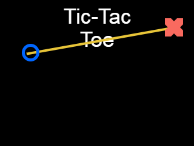

# 3D TicTacToe

A TicTacToe game for the **Nios II / DE1-SoC environment**, combining 2D and 3D game modes with VGA graphics, PS/2 mouse input, and audio.

Built by **George Gerges and Selim Abdelwahab** for **ECE243 at the University of Toronto**. This repository preserves the course project and is archived.

  

*Start-screen artwork from the project assets.*

## What is implemented

- **2D and 3D game modes:** menu navigation, board rendering, game state, and win handling.
- **Interactive 3D view:** mouse dragging rotates the board view.
- **VGA output:** 320 × 240 graphics with two frame buffers and vertical synchronization.
- **Hardware input and audio:** PS/2 mouse packet processing, Nios II interrupt handling, and memory-mapped audio output.
- **Asset preparation:** Python utilities convert image and sound assets into data used by the C program.

## Explore the code

| Location | Purpose |
| --- | --- |
| [main.c](main.c) | Game logic, rendering, mouse handling, interrupts, audio, and embedded asset arrays |
| [SoundandImages/](SoundandImages/) | Image and WAV conversion utilities |
| [images/](images/) and [sounds/](sounds/) | Original visual and audio assets |
| [images_out/](images_out/) and [sounds_out/](sounds_out/) | Converted asset data |

The game logic starts after the large asset arrays in `main.c`; search for `int main(void)` or `processMouse` to jump into the implementation.

## Build and run context

This is a hardware-targeted C program, not a desktop application. It uses Nios II control-register instructions and memory-mapped peripherals.

1. Obtain the source with `git clone https://github.com/gxorge13/3D-TicTacToe.git`.
2. Use a Nios II development environment configured for the DE1-SoC system used in ECE243, with VGA, PS/2, and audio peripherals.
3. Add `main.c` to that environment's C project. The repository does not include a standalone build script or a complete hardware project configuration.
4. Review the comments marked `UNCOMMENT WHEN RUNNING ON DE1-SOC` in `storePS2Data` before running on physical hardware; the checked-in mouse handling contains environment-specific adjustments.
5. Build and load using the configured environment, then use the on-screen menus and mouse. Drag in 3D mode to rotate the view.

**Verification status:** documentation has been checked against the source. A fresh hardware build and gameplay session have not been verified in this cleanup.

## Credits

This is a joint course project by George Gerges and Selim Abdelwahab. Features above describe the combined project, rather than assigning individual ownership of each component.
